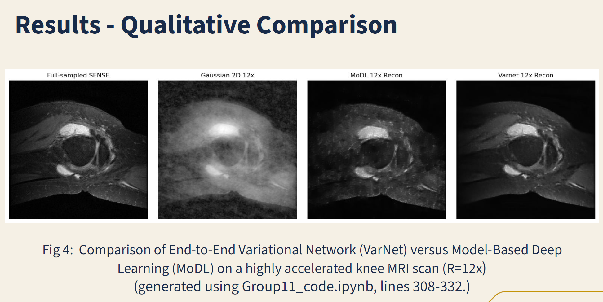

# BENG-280A-Comparison-of-E2E-VarNet-and-MoDL-for-Accelerated-MRI-Reconstruction
A comparative study of MoDL and End-to-End Variational Networks for highly accelerated MRI reconstruction using the Stanford Knee dataset.

# Comparison of E2E-VarNet and MoDL for Accelerated MRI Reconstruction

**Course:** BENG 280A
**Project Type:** Course Project

---

## Project Overview

Deep learning has rapidly advanced magnetic resonance imaging (MRI) reconstruction, particularly for accelerated acquisitions. A prominent class of methods, **Deep Unfolding Networks (DUNs)**, unroll iterative optimization algorithms into trainable neural network layers, enabling fast and high-quality MRI reconstruction.

In this project, we perform a systematic comparison between two widely used DUN architectures:

* **MoDL (Model-Based Deep Learning)**
* **End-to-End Variational Network (E2E-VarNet)**

The goal is to evaluate their reconstruction performance under highly accelerated MRI settings using both **quantitative metrics** and **qualitative visual analysis**.

---

## Objectives

* Evaluate and compare MoDL and E2E-VarNet for accelerated MRI reconstruction.
* Quantify reconstruction quality using standard image quality metrics.
* Visually assess reconstruction fidelity, artifact suppression, and anatomical detail.

---

## Methods

### Framework and Tools

* **ATOMIC / fastMRI Toolbox** for MRI reconstruction experiments
* Pretrained implementations of:

  * **MoDL**
  * **End-to-End Variational Network (E2E-VarNet)**

### Dataset

* **Stanford Knee MRI Dataset (2019)**
* Highly accelerated acquisition setting:

  * **Acceleration factor:** R = 12×
  * **Sampling pattern:** 2D Gaussian undersampling

### Evaluation Metrics

Reconstruction quality was evaluated using the following quantitative metrics:

* **PSNR (Peak Signal-to-Noise Ratio)** – signal fidelity
* **SSIM (Structural Similarity Index)** – perceptual and structural similarity
* **MSE (Mean Squared Error)** – absolute reconstruction error
* **NMSE (Normalized Mean Squared Error)** – relative reconstruction error

In addition, reconstructed images were visually inspected for artifact suppression, sharpness, and anatomical detail.

---

## Results

### Quantitative Comparison

| Metric         | Meaning               | MoDL (Baseline) | E2E-VarNet (Ours) | Improvement  |
| -------------- | --------------------- | --------------- | ----------------- | ------------ |
| **PSNR (dB)**  | Signal Clarity        | 23.73           | **31.31**         | **+7.58 dB** |
| **SSIM (0–1)** | Structural Perception | 0.581           | **0.762**         | **+31%**     |
| **NMSE**       | Normalized Error      | 0.1856          | **0.0388**        | **−79%**     |
| **MSE**        | Mean Squared Error    | 0.0049          | **0.0011**        | **−77%**     |

Across all metrics, **E2E-VarNet consistently outperformed MoDL**, demonstrating significantly higher fidelity and lower reconstruction error.

---

### Qualitative Comparison

```text
Figure 1: Qualitative comparison of accelerated MRI reconstruction (R = 12×)
```



Reconstruction examples from a highly accelerated knee MRI scan (R = 12×) show:

* **MoDL:**

  * Residual aliasing artifacts
  * Blurred anatomical boundaries
  * Loss of fine structural details

* **E2E-VarNet:**

  * Cleaner reconstructions
  * Sharper edges and clearer anatomy
  * Improved artifact suppression

These visual observations align with the quantitative improvements in PSNR, SSIM, MSE, and NMSE.

---

## Discussion

The superior performance of **E2E-VarNet** can be attributed to several architectural advantages:

* Higher-capacity **U-Net** backbone
* **End-to-end k-space data consistency updates**
* **Learned sensitivity maps**, enabling better multi-coil modeling

In contrast, **MoDL** is constrained by:

* Shallow CNN denoisers
* Weight sharing across iterations
* Image-space updates only
* Fixed **ESPIRiT** sensitivity maps

These design limitations likely restrict MoDL’s ability to recover fine details under aggressive undersampling.

---

## Conclusion

This project demonstrates that **End-to-End Variational Networks (E2E-VarNet)** provide **significantly higher-fidelity MRI reconstructions** compared to MoDL in highly accelerated settings.

Key takeaways:

* E2E-VarNet achieves superior quantitative performance across all evaluated metrics.
* Visual inspection confirms cleaner images with fewer artifacts and sharper anatomical details.
* End-to-end learning with k-space consistency and learned sensitivity maps is critical for high-quality accelerated MRI reconstruction.

---

## Reproducibility

Reconstruction results and figures were generated using the provided Jupyter notebook:

* `Group11_code.ipynb` (lines 308–332)

---

## Acknowledgments

* Stanford fastMRI / ATOMIC toolbox
* BENG 280A instructional staff

---

## License

This repository is intended for **academic and educational use only** as part of the BENG 280A course project.
